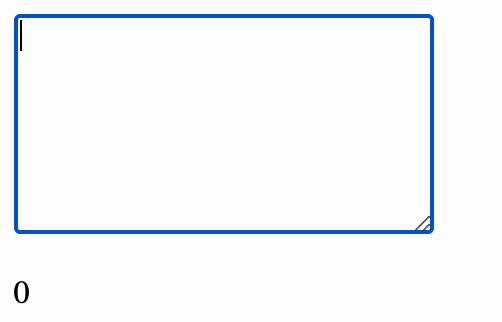

# Technical Writing Assignment

For guidance on setting up and submitting this assignment, refer to the Marcy lab School Docs How-To guide for [Working with Short Response and Coding Assignments](https://marcylabschool.gitbook.io/marcy-lab-school-docs/fullstack-curriculum/how-tos/working-with-assignments#how-to-work-on-assignments).

## Prompt 1

Describe the role of `addEventListener` and explain the advantages of using it over inline event handling in HTML. How does using `addEventListener` affect code readability and reusability?

### Response 1

## Prompt 2

What is **event delegation**, and how does **event bubbling** make it possible? How can event delegation improve performance when handling multiple similar events within a container? Provide an example to support your explanation.

### Response 2

## Prompt 3

The `removeEventListener` function can remove an event listener from a element in the DOM. Why might it be important to remove an event listener in certain situations?

### Response 3

## Prompt 4

Data validation is essential for forms. It ensures that information entered by users meets specific criteria before its submitted such as detecting if fields are empty, if fields are properly formatted (emails, phone numbers, etc...) and if fields contain malicious inputs.

Explain how data validation for form inputs can be handled both in HTML and JavaScript. Why is it beneficial to use both?

### Response 4

## Prompt 5

Imagine you are creating a brief "how-to" blog. In this response, briefly explain the steps to implement a form with a `textarea` input field that displays a live character count as a user types in the `textarea`. 

Your response should include code examples and an explanation of the code.

See below for the intended functionality:

### Response 5

